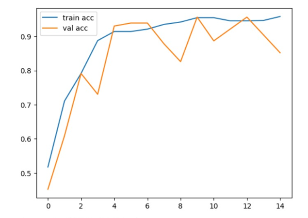
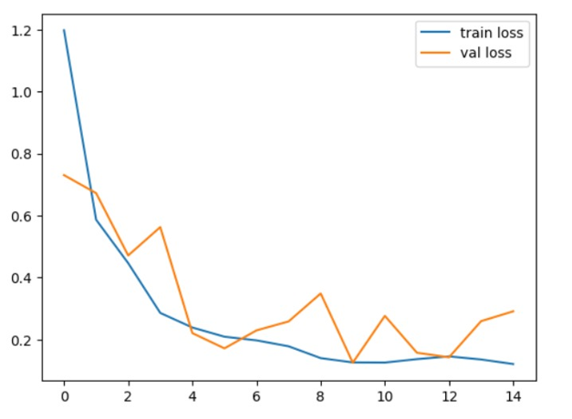

# Red Rot Sugarcane Disease Prediction System

## Project Overview

This repository contains a CNN + LSTM hybrid deep learning model for classifying sugarcane leaf images as `Healthy` or `Unhealthy` (red rot disease). The model uses convolutional layers to extract spatial features and LSTM layers to learn higher-level sequence patterns from projected feature sequences.

## Features

- Binary classification (Healthy vs Unhealthy)
- Training and evaluation script: `red_rot_prediction.py`
- Training accuracy and loss graphs included in `screenshots/`

## Technologies Used

- Python 3.8+
- TensorFlow / Keras
- OpenCV (cv2)
- NumPy
- scikit-learn

## Model Architecture

The model implements a CNN-LSTM hybrid:

- Convolutional layers (`Conv2D`) with pooling to extract spatial features
- A dense projection and `Reshape` to form a short sequence
- Stacked `LSTM` layers to learn sequence-level patterns
- A final `Dense` layer with `softmax` for classification

## Dataset Information

The dataset used for training is obtained from Kaggle and is NOT included in this repository. Do not upload the dataset to GitHub. Users must download the dataset separately and place it in the `dataset/` folder with this structure:

```
dataset/
├── Healthy/
│   ├── image1.jpg
│   └── ...
└── Unhealthy/
	├── image1.jpg
	└── ...
```

The dataset used for this project is available on Kaggle:

https://www.kaggle.com/datasets/alihussainkhan24/red-rot-sugarcane-disease-leaf-dataset

You can download it using the Kaggle CLI (recommended). Example commands:

```bash
# Install and configure the Kaggle CLI as documented by Kaggle
# Download and extract directly into the repository 'dataset/' folder
kaggle datasets download -d alihussainkhan24/red-rot-sugarcane-disease-leaf-dataset -p dataset --unzip
```

## Project Structure

Repository layout (top-level):

```
.
├── README.md
├── requirements.txt              # Python dependencies
├── red_rot_prediction.py         # Training & inference script (uses `dataset/`)
├── dataset/                      # NOT included: place Kaggle dataset here
│   ├── Healthy/
│   └── Unhealthy/
├── screenshots/                  # Training accuracy and loss graphs
│   ├── training-and-validation-accuracy.png
│   └── training-and-validation-loss.png
├── .gitignore                    # Ignores dataset, credentials, models, venvs
└── (optional) models/            # Saved model artifacts (add to .gitignore)
```

Notes:
- Put the downloaded Kaggle dataset into `dataset/` following the `Healthy/` and `Unhealthy/` subfolders.
- Do not commit `dataset/`, credential files, or trained model binaries to the repository.

## Installation and Setup

1. Create and activate a virtual environment:

```bash
python -m venv .venv
# Windows
.venv\Scripts\activate
# macOS / Linux
source .venv/bin/activate
```

2. Install dependencies:

```bash
pip install -r requirements.txt
```

3. Download and place the dataset into the `dataset/` folder as described above.

## Training Procedure

Run the training script from the repository root. The script expects the `dataset/` folder to exist and contain `Healthy/` and `Unhealthy/` subfolders.

```bash
python red_rot_prediction.py
```

The script will load and preprocess images, train the CNN-LSTM model, and print evaluation metrics.

## Prediction Procedure

Use the `predict()` function inside `red_rot_prediction.py` to run inference on an image inside the `dataset/` folder. Example usage:

```python
from red_rot_prediction import predict
predict('dataset/Healthy/example.jpg')
```

Replace the path with any image inside `dataset/`.

## Results

### Results Summary

The CNN-LSTM model was trained on the Red Rot Sugarcane Disease Leaf Dataset and evaluated using training and validation metrics. The accuracy and loss curves below illustrate the model's learning behavior across training epochs.

### Training Accuracy



### Training Loss



The accuracy plot shows training and validation accuracy per epoch; the loss plot shows training and validation loss per epoch. Inspect the curves to check for overfitting or underfitting.

## Future Improvements

- Add model checkpointing and early stopping
- Add command-line argument support for dataset path, epochs, and batch size
- Add a lightweight `predict.py` for inference and an export step to save the trained model
- Add tests and CI checks
- Use Git LFS or releases for large model artifacts

## Author

Vivek KM

